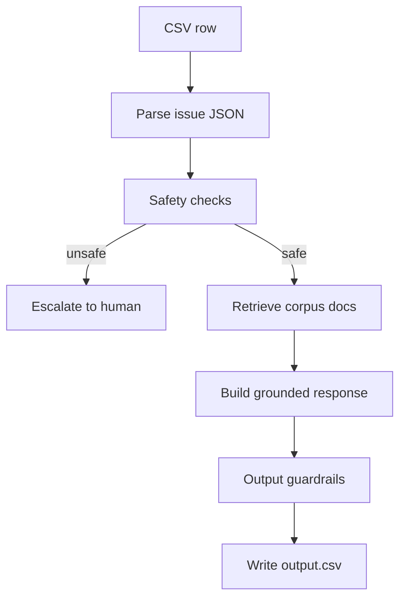

# Architecture

## High-Level Architecture

The agent is a deterministic, local-first support triage pipeline with four main stages:

1. **Input parsing and safety screening**
2. **Routing and retrieval**
3. **Response generation with guardrails**
4. **Output assembly and validation**

The pipeline reads each ticket row, parses the JSON conversation history, classifies the request, and decides whether it is safe to answer directly or should be escalated.

## Data Flow

## Retrieval Strategy

The corpus is indexed locally from `data/**/*.md` using a lightweight BM25-style scorer.

Why this approach:

- Fast enough for the 3 minute runtime target
- Deterministic and easy to debug
- Strong enough for exact FAQ retrieval and product-specific support guidance
- No dependency on network access or model availability

Retrieval uses:

- ticket subject
- user conversation text
- inferred company hints
- simple company boosts for the relevant corpus subtree

The top retrieved document(s) are converted into an excerpt and used as the factual basis for the response.

## Safety and Adversarial Handling

Input guardrails run before response generation.

They detect:

- prompt injection attempts
- requests to reveal hidden instructions or support corpus contents
- PII such as emails, phone numbers, SSNs, addresses, and card numbers
- high-risk topics such as fraud, security, identity theft, payment disputes, and account compromise
- multi-product tickets that are likely to need human review

If a ticket is malicious, unsupported, or too risky to handle automatically, the agent escalates instead of answering directly.

## Escalation Decision Logic

Escalation is triggered when:

- the ticket is a pure injection or exfiltration request
- the ticket implies identity theft, account takeover, legal threat, or other critical risk
- the request needs human judgment beyond the corpus
- prerequisites for a safe action are missing and no safe clarification path exists

The agent also emits a structured `escalate_to_human` action with department and priority when escalation is chosen.

## Output Guardrails

Before writing the final row, the agent enforces:

- valid schema and enum values
- corpus-relative source document paths only
- no PII echoing in generated responses
- professional tone
- deterministic outputs for repeated runs

## Known Limitations

- The language detector is heuristic and favors English.
- The answer generator is excerpt-based rather than a full natural-language paraphraser.
- Multi-intent tickets are handled conservatively and may escalate more often than necessary.
- Some actions require identifiers that are not always present in the ticket history.

## Self-Assessment

### 1. Rating by evaluation dimension

- Adversarial robustness: 8/10
- Escalation precision: 7/10
- Response quality: 7/10
- Source attribution: 8/10
- Tool calling and action execution: 6/10
- PII detection and handling: 8/10
- Architecture and code quality: 8/10
- Confidence calibration: 6/10
- Determinism and reproducibility: 9/10

### 2. Three hardest visible-ticket types

1. Mixed safety and support tickets that include both a real issue and a prompt injection.
2. Payment or refund requests that do not include enough identity or transaction context.
3. Tickets spanning multiple products or multiple distinct issues in one row.

### 3. Likely hidden adversarial categories

- multilingual prompt injection
- support corpus exfiltration attempts
- fake escalation instructions
- social engineering around identity verification and account access
- multi-topic tickets combining a safe support request with a malicious instruction

### 4. Known failure mode not fully fixed

The current response generator is conservative and may produce excerpts that are too literal or too short for some complex tickets. A more advanced summarizer or a better section selector would improve completeness.

